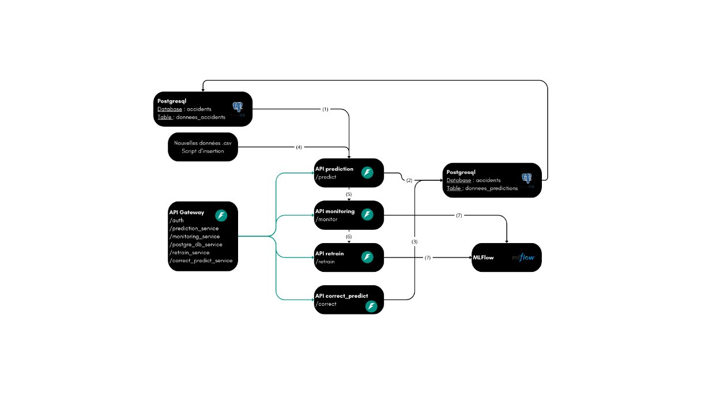

SafeRoads: app pour prédiction de la gravité des accidents routiers
==============================
Notre projet s'inscrit dans le cadre de la formation <a target="_blank" href="https://datascientest.com/formation-ml-ops">MLOPS.</a> dispensée par <a target="_blank" href="https://datascientest.com/">DataScientest.</a>. 

L'objectif étant de construire une application qui permet de **prédire** la gravité des accidents routiers **en temps réel** à partir de données historiques, afin **d'optimiser** la gestion des interventions d'urgence et de réduire les délais de réponse. Elle permet ainsi aux services de secours d'anticiper les ressources nécessaires et d'améliorer l'efficacité des opérations sur le terrain.

Equipe 
==============================
Les membres d'équipe sont:

- Marine Merle 
- Soumaya Jendoubi Elhabibi

Architecture de l'application
==============================
SafeRoads est conçu selon une architecture en microservices, avec une  API gateway  qui sert de point d'entrée unique pour tous les clients, en redirigeant les requêtes vers les microservices appropriés.

Chaque microservice s'exécute dans son propre conteneur Docker. Les requêtes sont traitées par une micro-API dédiée dans le conteneur, et la persistance des données est assurée via des volumes Docker.

Un versioning de modèles a été réalisé à l’aide de MLFlow.​

Ci_dessous est l'architecture globale:

Voici une liste des microservices fournis, y compris leurs URL et identifiants :

| Services              | URL                       | Credentiels           |
|-----------------------|---------------------------|-----------------------|
|API gateway            | http://localhost:8080     |Admin/User             |
|API prediction         | http://localhost:8001     |Admin/User             |
|API correct_prediction | http://localhost:8004     |Admin                  |
|API monitoring         | http://localhost:8002     |Admin                  |
|API retrain            | http://localhost:8003     |Admin                  |

L'organisation du projet
------------

    ├── LICENSE
    ├── README.md          <- Le fichier README pour les développeurs utilisant ce projet.
    ├──
    │
    ├── models             <- Premier modèle entrainé.
    │
    ├── notebooks          
    │
    │
    ├── reports            <- Analyses générées au format HTML, PDF, LaTeX, etc.
    │   └── figures        <- Génération de graphiques et de chiffres à utiliser dans les rapports.
    │   └── Mai24_CMLOPS_Accidents_Cdc.pdf
    │
    ├── requirements.txt   <- Le fichier d'exigences pour reproduire l'environnement de developpement,
    │                         généré avec `pip freeze > requirements.txt`
    │
    ├── src                <- Code source à utiliser dans ce projet.
    │   ├
    │   │
    │   ├── data           <- Données de référence.
    │   │      
    │   │   
    │   ├── scripts         <- Scripts pour ingérer et traiter les données, entraîner des modèles, puis utiliser des modèles entraînés pour effectuer des prédictions.
    │   │   │               
    │   │   ├── config_logging.py
    │   │   └── Ingestion.py
    │       └── Predict.py
    │   │   └── Preprocessing.py
    │   │   └── Training.py
    │   │
    │   ├── app                <- Scripts pour créer des conteneurs pour chaque service.
    │   │   └── api_gateway
    │   │   ├── monitoring_service  
    │   │   └── postgre_db_service
    │   │   └── prediction_service
    │   │   └── retrain_service
    │   │   └── correct_prediction_service
    │   │   └── db_service
    │   │   
    │   └── testing         <- Tests unitaires pour chaque service.
    │   │   └── test_endpoint_status.py
    │   │   ├── test_endpoint_retraining.py
    │   │   └── test_endpoint_prediction.py
    │   │   └── test_endpoint_monitoring.py
    │   │ 
    │── docker-compose.yml   
    │── logs

---------

## Etapes à suivre

### 1- Cloner le depôt git

   git clone https://github.com/Soumaya-JE/Mai24_MLOps_accidents.git

### 2- Créer un environnement virtuel en utilisant Virtualenv.

    python3 -m venv my_env

###   Activer

    source my_env/bin/activate (linux)

    my_env\Scripts\activate (windows)

###   Installer les packages de requirements.txt

    pip install -r  Mai24_MLOps_accidents/requirements.txt

###   Installer les  packages de docker

    
Installer docker engine en suivant <a target="_blank" href="https://docs.docker.com/engine/install/">ces instructions</a>. 
     

### 3- Construire les conteneurs Docker
    cd Mai24_MLOps_accidents
    docker-compose up --build

### 4- Vérifier le  bon fonctionnement de l'application

    L'interface Swagger de l'API gateway, qui propose une liste complète et interactive des points de terminaison, est disponible à cette adresse :
    http://0.0.0.0:8000/docs 

### 5- Arrêter l'application

    Utiliser Ctrl + C pour arrêter l'application.

### 6- Accéder aux images  hébérgées sur Dockerhub

  
   Vous pouvez télecharger les images dockerhub disponibles <a target="_blank" href="https://hub.docker.com/u/saferoads">ici</a>. 

    Exemple pour télécharger l'image du service "monitoting":
      docker pull saferoads/monitoring_service:latest

------------------------

<small>Project based on the <a target="_blank" href="https://drivendata.github.io/cookiecutter-data-science/">cookiecutter data science project template</a>. #cookiecutterdatascience</small>

